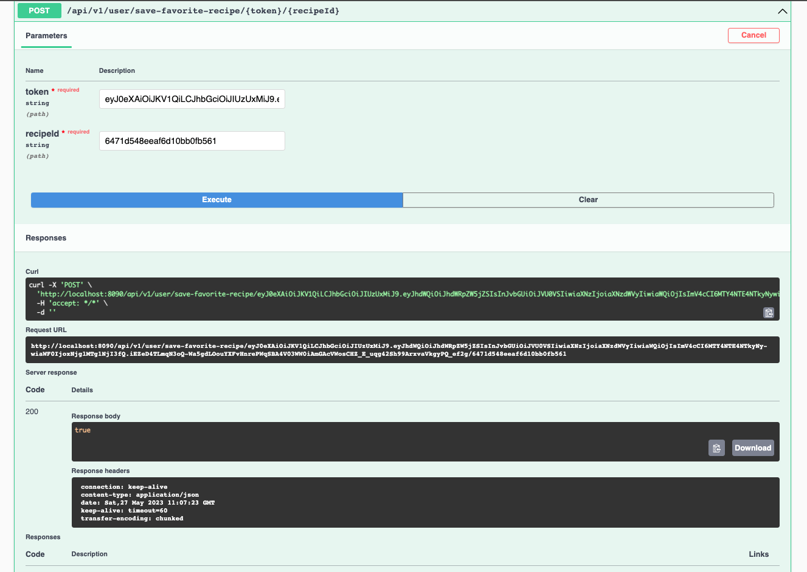
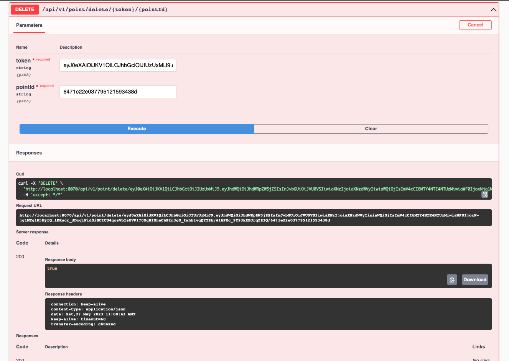

# <code style = "color:#4C4C6D"><u> RECIPE PROJECT </u> </code>
- Bu projede yemek tarifi uygulaması için, 'mikroservice' mimarisi kullanılarak, back-end kodları yazılmıştır.
- Kullanıcı bu programda sisteme kayıt olabiliyor, giriş yapabiliyor. 
- Sistemde eklenen tarifleri puanlayabiliyor, bu tariflere yorum yapabiliyor. 
- İstedikleri tarifleri favorilerine ekleyebiliyorlar.

## <code style = "color:#1B9C85"><u>Kullanılan yazılım dili: </u> </code>
- Java, Spring Boot

## <code style="color:#1B9C85"> <u> Kullanılan teknolojiler: </u> </code>
- OpenFeign, RabbitMQ, Redis, Zipkin, OpenAPI(SwaggerUI)

## <code style = "color:#1B9C85"><u> Kullanılan veritabanları: </u></code>
- PostgreSQL,MongoDB

## <code style="color:#1B9C85"><u>Kullanılan Service'ler ve Linkleri: </u></code>
* [Auth Service](http://localhost:8060/swagger-ui/index.html)
* [Comment Service](http://localhost:8070/swagger-ui/index.html)
* [Recipe Service](http://localhost:8080/swagger-ui/index.html)
* [UserProfile Service](http://localhost:8090/swagger-ui/index.html)
* Mail Service
* Config Server

## <code style= "color : #FFE194"><u> Auth Service</u></code>
- Kullanıcı işlemleri için kullanılan 'service'dir.
- Kullanıcının kayıt, giriş işlemleri, şifresinin unutulduğunda şifre değişikliği yapabildiği, 
hesabını aktif edebileceği servistir. 
 

<code style = "color :E8F6EF"><u>Kayıt Olma</u></code> 
   
<code style = "color :E8F6EF"><u>Giriş Yapma</u></code> 
   
<code style = "color E8F6EF"><u>Şifremi Unuttum</u></code> 

## <code style = "color : #FFE194"><u>User Service</u></code>
- Kullanıcının bilgilerini güncelleyebildiği, şifresini değiştirebildiği, 
tarifleri favorilerine ekleyebildiği servistir.
 

<code style = "color E8F6EF"><u>Kullanıcı Güncelleme</u></code> 
  
<code style = "color E8F6EF"><u>Kullanıcı Şifre Değiştirme</u></code> 
  
<code style = "color E8F6EF"><u>Kullanıcı Favorisine Tarif ekleme</u></code> 
  

## <code style = "color : #FFE194"><u> Comment Service </u></code>
- Kullanıcıların tariflere yorum yapabildiği,güncelleyebildiği ve silebildiği; aynı şekilde
tarifleri puanlayabildiği, puanını değiştirebildiği ve puanı silebildiği servistir.
 

<code style= "color: E8F6EF"><u>Yorum Ekleme</u></code> 
  
<code style = "color :E8F6EF"><u>Yorum Güncelleme</u></code> 
  
<code style = "color :E8F6EF"><u>Yorum Silme</u></code> 
  
<code style ="color : E8F6EF"><u>Puan Ekleme</u></code> 
  
<code style = "color : E8F6EF"><u>Puan Güncelleme</u></code> 
  
<code style = "color : E8F6EF"><u>Puan Silme</u></code> 
  

## <code style = "color :#FFE194"><u> Category Service </u></code>
- Yanlızca adminlerin işlem yapabildiği, tarifler için kategori işlemlerinin yapılabildiği servistir.
 

<code style = "color :E8F6EF"><u>Kategori Ekleme</u></code> 
  
<code style = "color :E8F6EF"><u>Kategori Silme</u></code> 
  

## <code style = "color : #FFE194"><u> Recipe Service </u></code>
- Yanlızca adminlerin işlem yapabildiği, tarifler ekleyip silebildiği ve güncelleyebildiği servistir.
 

<code style = "color :E8F6EF"><u>Tarif Ekleme</u></code> 
  
<code style ="color :E8F6EF"><u>Tarif Güncelleme</u></code> 
  
<code style ="color :E8F6EF"><u>Tarifleri Kategoriye göre sıralama</u></code> 
  
<code style ="color :E8F6EF"><u>Tarifleri Kategorilerine göre bulme</u></code> 
  
<code style = "color :E8F6EF"><u>Tarifleri içeriklerine göre bulma</u></code> 
  
<code style = "color :E8F6EF"><u>Tarifleri isimlerine göre bulma</u></code> 
  